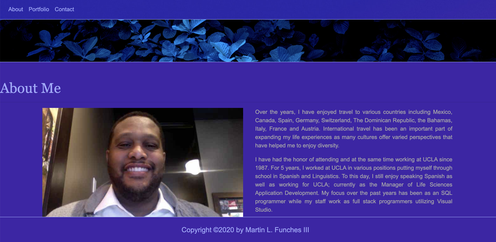

# *MLFPortfolio* 
    

## *Description*

This is my new portfolio format.  Used to keep my information up-to-date with static pages.

## *Table of Contents*

* [Installation](#installation)
* [Usage](#usage)
* [License](#license)
* [Contributing](#contributing)
* [Tests](#tests)
* [Questions](#questions)
   
## *Intallation*

None
      
## *Usage*    
N/A
    
## *License*
This project is licensed under the MIT license.
    
## *Contributing*
N/A
    
## *Tests*
N/A

## *Questions*

If you have any questions about the repo, open an issue or contact [mlfiii](https://api.github.com/users/mlfiii).